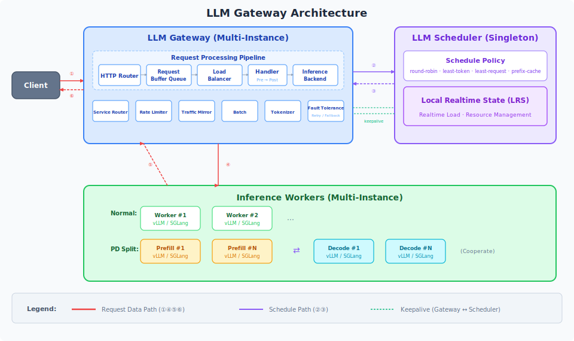

# LLM Gateway

[中文文档](docs/README_zh.md)

LLM Gateway is a high-performance gateway for Large Language Model (LLM) inference services, providing unified request entry, intelligent scheduling, load balancing, and traffic management capabilities.

**How it works**: Gateway handles client requests and forwards them to inference Workers; Scheduler maintains real-time load state of all Workers and provides optimal scheduling decisions to Gateway. Gateway can work independently (local round-robin), or collaborate with Scheduler for intelligent load balancing.

---

## Table of Contents

- [LLM Gateway](#llm-gateway)
  - [Table of Contents](#table-of-contents)
  - [Architecture](#architecture)
  - [API Reference](#api-reference)
  - [Gateway](#gateway)
    - [Service Router](#service-router)
    - [Processor Chain](#processor-chain)
    - [Fault Tolerance](#fault-tolerance)
    - [Traffic Mirror](#traffic-mirror)
    - [Batch](#batch)
    - [Tokenizer](#tokenizer)
  - [Scheduler](#scheduler)
    - [Schedule Policies](#schedule-policies)
    - [Local Realtime State (LRS)](#local-realtime-state-lrs)
    - [Rate Limiter](#rate-limiter)
    - [PD Split Mode](#pd-split-mode)
  - [Service Discovery](#service-discovery)
  - [Observability](#observability)
  - [Configuration](#configuration)
    - [Service Basics](#service-basics)
    - [Scheduling \& Load Balancing](#scheduling--load-balancing)
    - [Service Discovery](#service-discovery-1)
  - [Build \& Run](#build--run)
    - [Build](#build)
    - [Local Testing](#local-testing)
      - [Without Scheduler](#without-scheduler)
      - [With Scheduler](#with-scheduler)
      - [Send Requests](#send-requests)
    - [Release](#release)

---

## Architecture



**Architecture Overview**:
- **Gateway Layer (Multi-Instance)**: Stateless deployment, handles complete request data path (parse → queue → schedule → forward → response)
- **Scheduler Layer (Singleton)**: Centralized scheduling service, maintains real-time load state through **LRS (Local Realtime State)** and manages request resources
- **Worker Layer (Multi-Instance)**: Inference engine instances, supports three roles:
  - **Normal**: Regular service, can independently execute complete requests
  - **Prefill / Decode**: Collaborative execution in PD split mode
- **Keepalive**: Heartbeat mechanism between Gateway and Scheduler

**Path Separation**:
- **Request Data Path (①④⑤⑥)**: Client → Gateway → Worker → Gateway → Client, complete data loop
- **Schedule Path (②③)**: Gateway ↔ Scheduler, only transfers scheduling metadata (endpoint selection, resource release)

---

## API Reference

**Gateway Endpoints**:

| Method          | Path                        | Description                 |
| --------------- | --------------------------- | --------------------------- |
| POST            | `/v1/chat/completions`      | OpenAI Chat Completions API |
| POST            | `/v1/completions`           | OpenAI Completions API      |
| GET             | `/v1/models`                | List available models       |
| GET             | `/get_server_info`          | Get server information      |
| POST            | `/v1/messages`              | Anthropic Messages API      |
| POST            | `/v1/messages/count_tokens` | Count tokens                |
| POST/GET/DELETE | `/batch/*`                  | Batch service operations    |
| GET             | `/metrics`                  | Prometheus metrics          |
| GET             | `/healthz`                  | Health check                |

**Scheduler Endpoints**:

| Method | Path            | Description                                        |
| ------ | --------------- | -------------------------------------------------- |
| POST   | `/schedule`     | Receive scheduling request, return selected Worker |
| POST   | `/release`      | Release Worker resources after request completion  |
| POST   | `/report`       | Receive real-time request state from Gateway       |
| GET    | `/keepalive`    | WebSocket for Gateway heartbeat                    |
| GET    | `/ws/keepalive` | WebSocket for Worker registration                  |
| GET    | `/healthz`      | Health check                                       |
| GET    | `/metrics`      | Prometheus metrics                                 |

---

## Gateway

### Service Router

**Path**: [`pkg/gateway/service/router/`](pkg/gateway/service/router/)

`ServiceRouter` runs before Load Balancer, determines request destination:

| Route Type      | Description                                                       |
| --------------- | ----------------------------------------------------------------- |
| `RouteInternal` | Route to internal Worker (via Load Balancer)                      |
| `RouteExternal` | Forward to external URL (e.g., third-party OpenAI-compatible API) |
| `RouteUnknown`  | No match, try Fallback                                            |

Supports two routing strategies:
- **weight**: Random distribution by weight, supports A/B testing
- **prefix**: Match by request `model` name prefix, route different models to different backends

---

### Processor Chain

**Path**: [`pkg/gateway/processor/`](pkg/gateway/processor/)

Requests pass through configurable processor chains before/after Handler:

- **PreProcessorChain**: Request preprocessing (e.g., Tokenizer counting, parameter validation, content rewriting)
- **PostProcessorChain**: Response post-processing (e.g., response formatting, Tool Call parsing, Reasoning parsing)

---

### Fault Tolerance

Provides retry and fallback mechanisms:

| Feature       | Description                                                                                                   |
| ------------- | ------------------------------------------------------------------------------------------------------------- |
| Retry         | `--retry-count` sets retry attempts on forward failure                                                        |
| Retry Exclude | `--retry-exclude-scope` controls exclusion granularity (`instance` or `host`)                                 |
| Fallback      | Routes marked `"fallback": true` in `ServiceRouter` config are tried sequentially when internal services fail |

---

### Traffic Mirror

**Path**: [`pkg/gateway/service/mirror/`](pkg/gateway/service/mirror/)

Mirrors request traffic to specified endpoints for testing or analysis purposes without affecting the main request flow.

---

### Batch

**Path**: [`pkg/gateway/batch/`](pkg/gateway/batch/)

Enable via `--batch-oss-path` for offline batch inference:

- Task files stored in Alibaba Cloud OSS
- Task state persisted via Redis
- `TaskReactor` pulls pending tasks, processes in parallel by Shard
- Each record initiates independent inference request with retry support

---

### Tokenizer

**Path**: [`pkg/gateway/tokenizer/`](pkg/gateway/tokenizer/)

Token counting and management:

| Parameter              | Description             |
| ---------------------- | ----------------------- |
| `--tokenizer-name`     | Built-in tokenizer name |
| `--tokenizer-path`     | Custom tokenizer path   |
| `--chat-template-path` | Chat template path      |

---

## Scheduler

### Schedule Policies

Configure via `--schedule-policy`:

| Policy          | Description                                                                         |
| --------------- | ----------------------------------------------------------------------------------- |
| `round-robin`   | Pure local round-robin, no Scheduler process needed                                 |
| `least-token`   | Select instance with lowest current token usage (requires Scheduler)                |
| `least-request` | Select instance with fewest current requests (requires Scheduler)                   |
| `prefix-cache`  | Select based on prefix cache hit rate, maximize KV Cache reuse (requires Scheduler) |

---

### Local Realtime State (LRS)

**Path**: [`pkg/scheduler/lrs/`](pkg/scheduler/lrs/)

Maintains real-time state for each Worker:
- Gateway reports incremental token state via `/report`
- Scheduler reads instance load through LRS during scheduling to select optimal Worker

---

### Rate Limiter

**Path**: [`pkg/scheduler/rate-limiter/`](pkg/scheduler/rate-limiter/)

Request rate limiting functionality to protect backend services from overload.

---

### PD Split Mode

LLM Gateway supports two inference modes:

**Normal Mode (Default)**: A single Worker completes the entire Prefill + Decode process, suitable for most scenarios.

**PD Split Mode**: Separates Prefill and Decode stages to different Workers. Enable via `--pdsplit-mode`, supports following implementations:

| Mode              | Description                              |
| ----------------- | ---------------------------------------- |
| `vllm-kvt`        | vLLM + KV Transfer for KV Cache transfer |
| `vllm-vineyard`   | vLLM + Vineyard (distributed memory)     |
| `vllm-mooncake`   | vLLM + Mooncake transport layer          |
| `sglang-mooncake` | SGLang + Mooncake transport layer        |

**Workflow**:

```
Gateway
  │
  ├─ 1. Schedule Prefill Worker (InferStagePrefill)
  │       Balancer.Get() → prefillLocalBalancer
  │
  ├─ 2. Handler sends request to Prefill Worker
  │       On completion, trigger OnPostPrefillStream
  │       ├─ Release Prefill Worker resources
  │       └─ Record TTFT metric
  │
  ├─ 3. Schedule Decode Worker (InferStageDecode)
  │       PDSeparateSchedulerImpl.ScheduleDecode()
  │       → decodeLocalBalancer
  │
  └─ 4. Handler sends Decode request to Decode Worker
          Per-chunk trigger OnPostDecodeStreamChunk
          → LRS reports real-time state
```

**Separate scheduling mode (`--separate-pd-schedule`)**: Prefill and Decode scheduled independently in two phases (`ScheduleModePDStaged`); otherwise combined in one schedule (`ScheduleModePDBatch`).

---

## Service Discovery

**Path**: [`pkg/resolver/`](pkg/resolver/)

Supports multiple service discovery mechanisms implementing `LLMResolver` interface:

| Implementation      | Description                                           |
| ------------------- | ----------------------------------------------------- |
| `EASResolver`       | Alibaba Cloud EAS platform built-in service discovery |
| `RedisResolver`     | Redis-based instance registration and discovery       |
| `MsgBusResolver`    | Message bus-based instance discovery                  |
| `EndpointsResolver` | Static endpoint list (for local testing)              |

All resolvers implement `Watch(ctx)` method, pushing `WorkerEventAdd` / `WorkerEventRemove` / `WorkerEventFullSync` events via channel to drive LRS state updates.

---

## Observability

**Prometheus Metrics** (`/metrics` endpoint):

| Metric                     | Type      | Description                                             |
| -------------------------- | --------- | ------------------------------------------------------- |
| `llm_requests`             | Counter   | Total requests (aggregated by status_code, model, etc.) |
| `llm_response_time`        | Histogram | Total request latency (ms)                              |
| `llm_ttft`                 | Histogram | Time To First Token (ms)                                |
| `llm_tpot`                 | Histogram | Time Per Output Token (ms)                              |
| `gateway_pending_requests` | Gauge     | Requests in queue + scheduling                          |
| `gateway_requests`         | Gauge     | Current total active requests                           |

**Access Log** format (`--enable-access-log`):
```
Request completed [<id>] status_code:<code>,method:<method>,url:<url>;
<timing>;input_tokens:<n>,total_tokens:<n>;sch_results:<worker>;
queue:<n>,sch:<n>,work:<n>,model:<model>
```

---

## Configuration

Startup parameters (`--help` for full list), common configurations grouped as follows:

### Service Basics

| Parameter         | Default   | Description               |
| ----------------- | --------- | ------------------------- |
| `--port`          | `8001`    | Listen port               |
| `--host`          | `0.0.0.0` | Listen address            |
| `--schedule-mode` | `false`   | Start in Scheduler mode   |
| `--llm-scheduler` | —         | Scheduler service address |

### Scheduling & Load Balancing

| Parameter                | Default       | Description                           |
| ------------------------ | ------------- | ------------------------------------- |
| `--schedule-policy`      | `least-token` | Scheduling policy                     |
| `--pdsplit-mode`         | —             | PD split mode                         |
| `--separate-pd-schedule` | `false`       | Whether to schedule P/D independently |
| `--max-queue-size`       | `512`         | Max request buffer queue length       |

### Service Discovery

| Parameter              | Default | Description                                             |
| ---------------------- | ------- | ------------------------------------------------------- |
| `--use-discovery`      | —       | Discovery mode (`cache-server`, `message-bus`, `redis`) |
| `--discovery-endpoint` | —       | Discovery service address                               |

---

## Build & Run

### Build

```bash
make llm-gateway-build
```

### Local Testing

#### Without Scheduler

Gateway forwards requests directly via round-robin:

```bash
# Start mock inference servers
./bin/mock-llm-server --port 8080 --model mock-model -v=2
./bin/mock-llm-server --port 8081 --model mock-model -v=2

# Start Gateway
./bin/llm-gateway --port 8001 --local-test-ip 127.0.0.1:8080,127.0.0.1:8081
```

#### With Scheduler

Gateway dispatches requests through Scheduler:

```bash
# Start mock inference servers
./bin/mock-llm-server --port 8080 --model mock-model -v=2
./bin/mock-llm-server --port 8081 --model mock-model -v=2

# Start Gateway
./bin/llm-gateway -v=2 --port 8001 \
  --local-test-scheduler-ip 127.0.0.1:8002 \
  --local-test-ip 127.0.0.1:8080,127.0.0.1:8081

# Start Scheduler
./bin/llm-gateway -v=2 --schedule-mode --port 8002 \
  --local-test-backend-ip 127.0.0.1:8080,127.0.0.1:8081
```

#### Send Requests

Chat Completions (streaming):

```bash
curl http://127.0.0.1:8001/v1/chat/completions \
  -H "Content-Type: application/json" \
  -d '{
    "model": "mock-model",
    "stream": true,
    "messages": [{"role": "user", "content": "What is the weather like in New York?"}]
  }'
```

Completions (non-streaming):

```bash
curl http://127.0.0.1:8001/v1/completions \
  -H "Content-Type: application/json" \
  -d '{
    "model": "mock-model",
    "stream": false,
    "prompt": "Hello!",
    "max_tokens": 128
  }'
```

### Release

```bash
make llm-gateway-docker-build    # Build arm/amd multi-arch image
make llm-gateway-docker-release  # Push image
```
