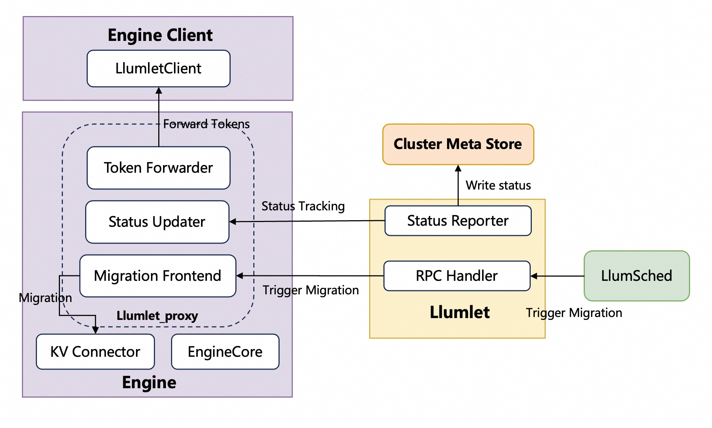

# Architecture-Llumlet&Llumlet\_proxy

## Architecture Diagram

{width="70%"}
Llumlet\_proxy and Enginecore share a single process, whereas Llumlet is a standalone process.

## Component Responsibilities

### Llumlet\_proxy (EngineCore Extensions)

The `llumlet_proxy` is a set of extensions integrated into the engine core, designed to facilitate instance migration and enhance observability. Its key responsibilities are handled by the following components:

#### Migration frontend worker thread

The Migration Frontend worker thread is a component within `Llumlet_proxy` responsible for handling migration requests.Its process is as follows:

1.  It receives a "migrate-out" request from `Llumlet`, which serves as its primary input.
    
2.  Based on this request, the Migration Frontend thread selects the specific request IDs that are designated for migration.
    
3.  Finally, it forwards these selected IDs to the KV Connector, which in turn instructs its backend to initiate the actual migration process.
    
#### Post-migration token forwarder threads
    
To ensure a seamless user experience after a migration is complete, these dedicated threads capture and forward newly generated tokens from the migrated instance back to the original client, preventing any disruption or loss of output. The original token output mechanism in vLLM, which operates between `EngineCore` and `EngineClient`, is overwritten. The EngineClient component within Llumnix is responsible for instantiating a LlumnixClient. Concurrently, the token forwarder, a module of Llumlet\_proxy, builds a connection pool that connects to one or more of these LlumnixClient instances.
    
#### Instance status updater
    
The `instance updater` is responsible for retrieving and maintaining the real-time status of the instance from the `engine core`. It operates in two distinct modes to communicate this status to `Llumlet`. In push mode, it proactively sends the latest `instance status` to `Llumlet`. In pull mode, it waits for `Llumlet` to periodically fetch or "pull" these metrics.
    
### Llumlet Processor
    
`Llumlet` operates as a local agent for the `EngineCore`, running as its child process. Its primary purpose is to act as a communication bridge between the `EngineCore` and `LlumletSched`. This involves two key functions: handling incoming RPC requests, and proactively reporting the latest `instance status` back to the CMS on a regular basis.
    
#### RPC Handler
    
The RPC server exposes a set of gRPC endpoints to enable external control over the Llumlet process. The core functionalities are provided through the following interfaces:
##### `Migrate`
```python
async Migrate(request: MigrateRequest) -> MigrateResponse
```

Initiates a "migrate-out" operation, instructing the  to migrate one or more active requests to a target engine. This is the primary entry point for workload relocation.

The parameters in the `MigrateRequest` message are as follows:
*   `dst_engine_ip` : The IP address of the destination engine that will receive the migrated requests.
    
*  `dst_engine_port`: The port number of the destination engine's RPC server.
    
*   `migration_type`: Specifies the policy for selecting requests to migrate. Must be one of `NUM_REQ`, `TOKEN`, or `RATIO`. This parameter determines which of the following conditional fields are required.
    
*   `num_reqs` (conditional): The number of requests to migrate. This field is required if `migration_type` is `NUM_REQ`.
    
*   `num_tokens` (conditional): The target number of tokens to migrate. The system will select requests until cumulative token count is closest to this value. This field is required if `migration_type` is `TOKEN`.
    
*   `block_ratio` (conditional): The ratio of KV cache blocks to free up via migration. For example, `0.5` means migrating requests until 50% of the blocks are freed. This field is required if `migration_type` is `RATIO`.
    
*   `mig_req_policy` : Defines the policy for choosing which specific requests to migrate (e.g., "SR" means shortest context request first).
    
*   `trigger_policy`: Defines the condition that triggers the migration. For example, `"DECODE_LOAD"` initiates a migration to maintain load balance among decode instances.
    

##### `MigrateIn`

```Python
async MigrateIn(request: MigrateInRequest) -> MigrateInResponse
```

Handles a "migrate-in" operation by receiving a serialized request from another engine and resuming its execution on the current instance. This allows the `Llumlet` to act as a migration destination. This interface is typically not invoked by `LlumSched`. The engine calls it directly upon triggering a migration.

The parameters in the `MigrateInRequest` message are as follows:

*   `serialized_migrate_req` : A byte stream containing the complete, serialized state of the request to be resumed, including its prompt, sampling parameters, and KV cache state.
    
*   `serialization_format` (`string`): Specifies the encoding scheme used for the `serialized_migrate_req` payload (e.g., "pickle"), allowing the handler to correctly deserialize the data.
    

##### `Abort`

```go
async Abort(request: AbortRequests) -> AbortResponse
```

This interface is designed for a specific scenario that occurs after a request has been migrated. If the original `engine client` process needs to abort that request, it must route the `abort` command through the `Llumlet`. The `Llumlet` receives this request and then forwards it to the appropriate destination `enginecore` where the request is now running.

The parameters in the `AbortRequests` message are as follows:

*   `request_ids` : A list of unique identifiers for the requests that need to be aborted.
    

#### Status Reporter

Another key role of Llumlet is to periodically report the latest instance status to the CMS (Central Management System). The detailed description is in Readtime Instance Status Tracking. Furthermore, when the enginecore terminates, Llumlet is designed to actively remove the instance's associated data from the CMS.

## Lifecycle

Llumlet's lifecycle design is intricately coupled with that of the vLLM engine instance. This means the startup, operation, and termination of the Llumlet process are kept in high synchronicity with its target vLLM engine process.

### Startup and Initialization 

Llumlet is deployed as an integral part of the vLLM engine setup. It initiates concurrently with or immediately after the vLLM engine process, never operating independently. During this initialization, Llumlet identifies its assigned vLLM engine instance, establishes necessary connections to the engine's internal state or monitoring APIs, and configures its status reporting mechanisms to the Central Management System (CMS) (e.g., CMS address, authentication details, reporting frequency).
    
### Termination and Shutdown:
    
1. Graceful Shutdown: Upon receiving a `SIGTERM` signal (indicating a graceful shutdown request), Llumlet detects the monitored vLLM engine instance undergoing its own graceful shutdown. Before completing its own termination, Llumlet will remove the instance's data from the CMS and then gracefully terminates itself.
        
2. Abnormal Exit: If the vLLM engine instance crashes unexpectedly or is forcibly terminated without Llumlet receiving a `SIGTERM` signal, Llumlet's periodic health checks will detect the communication failure or the disappearance of its monitoring target. In this scenario, Llumlet will not immediately self-terminate. Instead, it will persistently attempt to report an `unschedulable` status to the CMS. This behavior continues until an external entity (e.g., Kubernetes) eventually cleans up the Llumlet process.