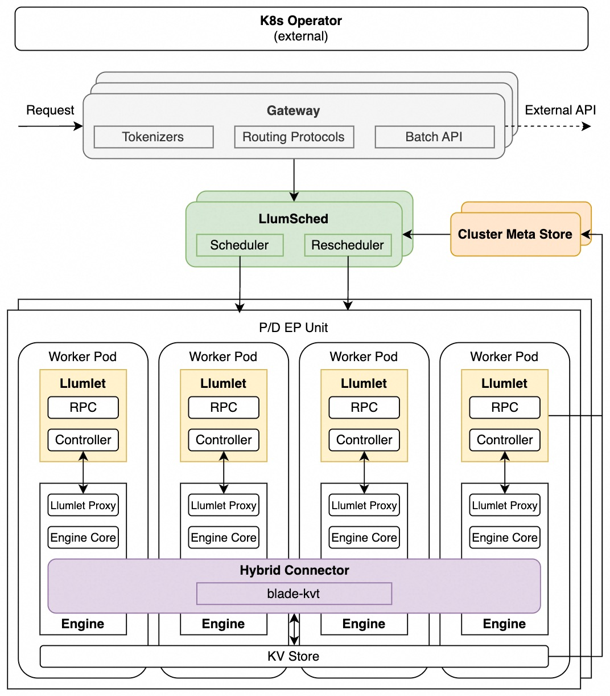

# Architecture Overview

## System Diagram

  

### Components
#### 1. LlumSched
LlumSched is the central scheduling component. It operates in two roles:
- **Scheduler**: makes initial routing decisions for incoming requests, selecting the target instance based on scheduling policy and current instance load
- **Rescheduler**: continuously monitors instance status and migrates in-flight requests between instances for multiple purposes, e.g., to rebalance load, to satisfy SLO, to handle engine failures

LlumSched implements a **metrics → filters → selectors** scheduling pipeline. See [Scheduling Policy Framework](./scheduling/policy_framework.md) for details on built-in policies, scheduling modes.

#### 2. Llumlet
Llumlet is an engine-side agent deployed alongside each inference engine instance. It bridges the global scheduling components and the local inference engine:

- Collects engine-internal status directly from the engine
- Writes instance status to the Cluster Metadata Store (CMS) for the scheduler to consume
- Enables live request migration between instances
- Llumlet is deployed only in full mode. See [Llumlet & Llumlet Proxy](./llumlet/Llumlet&Llumlet_proxy.md) for implementation details.

#### 3. Cluster meta store
Cluster meta store (CMS) is a shared store for real-time instance status. It serves as the source of truth for the scheduler's view of the cluster in full mode:

- Llumlet writes per-instance status to CMS after each load-change event
- The scheduler reads from CMS to build its cluster view before each scheduling decision
- CMS is only used in full mode. In lite mode, the scheduler maintains a Local Real-time State (LRS) instead.

#### 4. Engine
Llumnix integrates with vLLM as the underlying inference engines. In full mode, Llumnix applies patches to the engine to:

- Export engine-internal state to Llumlet at load-change events
- Support live request migration

#### 5. Gateway
The Gateway is the entry point for all client requests. Beyond simple request forwarding, it provides LLM-specialized capabilities:

- Tokenization: tokenizes prompts to compute token counts for scheduling decisions
- Request routing: supports routing protocols for different PD disaggregation schemes

#### 6. Hybrid Connector
Hybrid connector ([llumnix-kv](https://github.com/llumnix-project/llumnix-kv)) serves as a unified control plane for KV cache transfer and storage, mixing multiple paths in one KV connector:
- KV transfer: using blade-kvt for high-performance KV cache transfer, for both PD disaggregation and request migration
- KV storage: supports offloading KV cache to external storage (e.g., Mooncake)

## Key Features

Beyond its core components, Llumnix provides the following features:

1. **Scheduler + rescheduler architecture** for fully dynamic request scheduling
   - Scheduler for initial routing
   - [Rescheduler](./rescheduler.md) for continuous migration

2. **Advanced scheduling policies** for modern distributed serving
   - Extreme load balancing for PD+EP: migration-enhanced DPLB, predictor-based prefill scheduling, [SLO-based scheduling](./scheduling/slo_aware_scheduling.md)
   - Precise [KV-aware Scheduling](./scheduling/cache_aware_scheduling.md)
   - [Adaptive PD disaggregation](./scheduling/adaptive_pd_scheduling.md): taming instantaneous P-D load fluctuation

3. **Realtime tracking of instance status** for optimal scheduling quality
   - Lightweight scheduler-engine sync to eliminate information lag — see [Instant and Accurate Load](./scheduling/instant_accurate_load.md)

4. **Modular, extensible scheduling policy framework** for easily implementing and composing new policies — see [Schedule Policy Framework](./scheduling/policy_framework.md)

5. **Dual-mode scheduling**
   - Full-mode for max performance with engine participation (white-box)
   - Lite-mode for engine-transparent deployments (black-box)

6. **LLM-specialized request gateway**
   - Different [PD disaggregation protocols](./gateway/pdd_protocol.md)
   - [Batch API](./gateway/batch_inference.md)

7. **Fault tolerance**
   - Fault tolerance for Llumnix components
   - Engine health monitoring and reactive (re-)scheduling upon engine failures