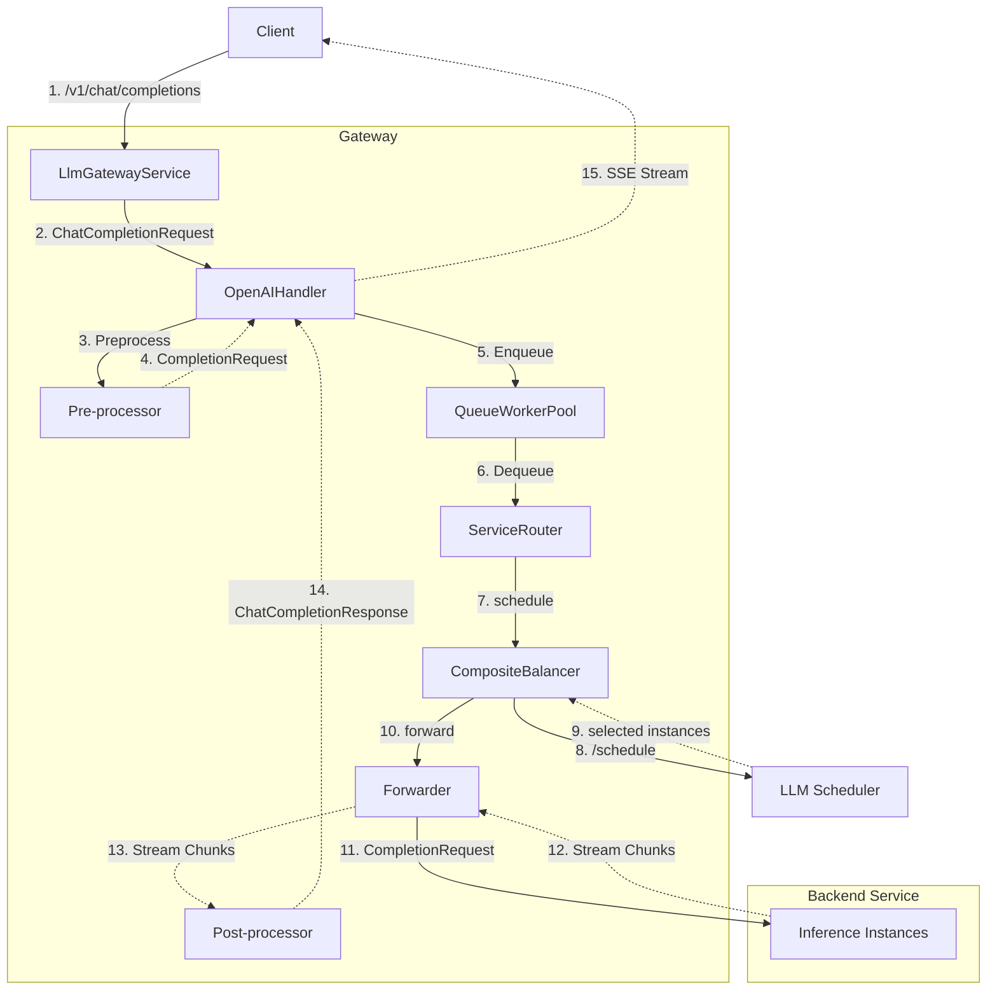

# Gateway Architecture

## Overview

The gateway (`pkg/gateway`) is the entry point for all inference traffic. It accepts OpenAI-compatible HTTP requests, routes them to the appropriate backend instances, streams responses back to clients, and reports scheduling state to the LLM scheduler.

The gateway is organized into the following modules:

| Module | Responsibility |
|---|---|
| `service` | HTTP server, request lifecycle orchestration |
| `handler` | Protocol parsing and streaming response loop |
| `tokenizer` | Prompt tokenization and chat template application |
| `processor` | Pre- and post-request transformation pipeline |
| `queue` | Priority queue and worker pool for traffic buffering |
| `router` | Model-based routing policy (prefix or weight) |
| `load-balancer` | Instance selection (local round-robin or remote scheduler) |
| `forwarder` | Backend HTTP forwarding and SSE streaming |
| `lrs` | Real-time request state tracking and periodic reporting to the scheduler |
| `mirror` | Async traffic mirroring to a secondary target |
| `batch` | Async batch inference API backed by OSS and Redis |

---

## Gateway Components

### service

`LlmGatewayService` is the top-level HTTP server. It registers the following routes and owns the main request lifecycle: creating the request context, invoking the handler for parsing and pre-processing, dispatching to the buffer queue, splitting traffic across backends via the router's routing policy, selecting backend instances via the load-balancer, and dispatching to the backend via the forwarder and streaming post-processed response chunks back to the client.

| Method | Path | Description |
|---|---|---|
| POST, GET | `/v1/chat/completions` | OpenAI chat inference |
| POST, GET | `/v1/completions` | OpenAI completion inference |
| GET | `/v1/models` | List available models |
| GET | `/healthz` | Health check |

The gateway also exposes a set of batch inference APIs for file and batch task management: clients upload JSONL input files, each line is processed asynchronously against the inference backend, and JSONL output files are written when the batch completes. See the [batch](#batch) module for details.

### handler

`OpenAIHandler` is the protocol handler for all OpenAI-compatible requests. It parses the request body into a `ChatCompletionRequest` or `CompletionRequest`, runs the pre-processor chain, then drives the streaming response loop: it invokes the forwarder to obtain a chunk channel, passes each chunk through the post-processor chain, and pushes the marshaled result onto the response channel. Lifecycle hooks fire at key points (post-prefill, per-decode-token, post-request) to report token state and release scheduler resources.

### tokenizer

`tokenizer` wraps the `sglang-go-grpc-sdk` tokenizer as a singleton. It loads the tokenizer on first use, reads `model_max_length` from the model config, and registers built-in tokenizers from the embedded tokenizer directory. `RequestCompletionConverter` uses it to apply chat templates and compute token IDs; `ResponseChunkProcessor` uses it to count output tokens.

### processor

The handler invokes the processor pipeline at two points in the request lifecycle: before forwarding (pre-processing) and on each response chunk (post-processing). Both processors require the tokenizer to be configured (via `--tokenizer-name` or `--tokenizer-path`); the gateway fails to start if the tokenizer is unavailable.

`RequestCompletionConverter` (pre-processor) converts the incoming request into a `CompletionRequest` with token IDs. For completion requests, the prompt string is encoded directly into token IDs. For chat completion requests, the chat template is first applied to the messages to produce a formatted prompt string, and the formatted prompt string is then encoded into token IDs. It also computes `max_tokens` from the model's context length minus the input length, and forces `stream=true` on every backend request.

`ResponseChunkProcessor` (post-processor) converts raw `CompletionResponse` chunks into OpenAI-compatible `ChatCompletionStreamResponse` or `ChatCompletionResponse` objects, and accumulates chunks for non-streaming clients. When `--reasoning-parser` is configured, it additionally invokes `ReasoningParser` to split `<think>…</think>` blocks into `reasoning_content` and `content` fields across chunk boundaries; when `--tool-call-parser` is configured, it runs an incremental tool-call parser. `ReasoningParser` supports multiple model families (deepseek-r1, qwen3, kimi, glm, minimax, step).

### queue

`QueueWorkerPool` buffers incoming requests and controls the concurrency of scheduling and forwarding via a fixed pool of worker goroutines. Tasks are assigned high or normal priority and dequeued in priority order, with FIFO preserved within the same priority level. When the queue is at capacity, new tasks are rejected immediately. `ModelQueueWorkerPool` extends this with per-model worker pools.

### router

`ServiceRouter` determines whether a request is forwarded to the internal backend (via the load-balancer) or proxied to an external service endpoint. Without routing configs, all requests go internal. Two routing policies are supported:

- **`weight`**: distributes traffic across configured endpoints by weighted random sampling. Each endpoint is either the internal backend or an external service URL.
- **`prefix`**: routes based on the request's model name, using longest-prefix matching against configured prefixes. Exact matches take precedence over wildcard (`*`-suffix) matches.

The router also provides ordered fallback endpoints for requests that fail on the primary route.

### load-balancer

`CompositeBalancer` selects between four internal balancers based on the configured scheduling mode:

- **`LocalBalancer`**: non-PD deployment without a remote scheduler; uses round-robin.
- **`RemoteBalancer`**: non-PD deployment with a remote scheduler; falls back to round-robin when the scheduler is unavailable.
- **`PDLocalBalancer`**: PD deployment without a remote scheduler; uses separate round-robin balancers for the prefill and decode stages.
- **`PDRemoteBalancer`**: PD deployment with a remote scheduler; falls back to separate prefill/decode round-robin balancers when the scheduler is unavailable.

The round-robin balancer maintains a live instance list by subscribing to resolver add/delete events. The remote scheduler client POSTs scheduling requests (model, gateway ID, token IDs, scheduling mode, scheduling stage) to the scheduler's `/schedule` endpoint and releases instances asynchronously via `/release`.

### forwarder

`Forwarder` dispatches one or two backend HTTP calls based on a `RequestContext` and returns a `<-chan StreamChunk`. This abstraction shields the handler from backend protocol differences: regardless of whether the deployment is non-PD or PD disaggregated, the handler always consumes the same chunk channel.

For non-PD deployments, a single request is sent to the selected instance. For PD disaggregated deployments, the forwarder implements the protocol-specific dispatch logic, including how KV transfer parameters are constructed and how requests are issued to prefill and decode instances. The concrete forwarder is selected at startup based on `--pd-disagg-protocol` (e.g., `vllm-kvt`, `vllm-mooncake`). See [P/D Disaggregation Protocol](pdd_protocol.md) for protocol details.

### lrs

`lrs` (Local Real-time State) supplies real-time per-request token state to the lite-mode scheduler. As each decode chunk arrives, `RequestStateTracker` updates the output token count for the corresponding streaming request. A background goroutine periodically reports the per-request state (model, instance ID, output token count) to the remote scheduler, realizing streaming-driven token count updates — the theoretically optimal temporal freshness for scheduler-side bookkeeping. `lrs` is only active in lite-mode scheduling (i.e., when `--enable-full-mode-scheduling` is not set).

### mirror

`Mirror` optionally shadows a configurable fraction of requests to a secondary target. On each inference request, it samples against a configured ratio and, if selected, asynchronously replays the request to the mirror URL with an optional authorization override and per-request timeout. The mirror config (enable/disable, target URL, ratio, timeout) is hot-reloaded from disk without restarting the gateway.

### batch

`BatchService` implements the OpenAI batch inference API. Clients upload JSONL input files; the service stores them in Alibaba Cloud OSS, tracks task state in Redis, and processes individual lines by forwarding them to the gateway's own `/v1/completions` endpoint. Background reactor goroutines drive state transitions: validating → in_progress → finalizing → completed (or failed / cancelled / expired). Results are written back to OSS as JSONL output files. See [Batch Inference](batch_inference.md) for the full design.

---

## Gateway Request Lifecycle

The following describes how a `/v1/chat/completions` request travels through the gateway.

### 1. HTTP Request Reception

The HTTP router dispatches the request to the gateway service. The gateway service creates a `RequestContext` - a lightweight container holding request metadata, token state, statistics, scheduling context, hooks, and response channel, then hands it to the handler for parsing and pre-processing.

### 2. Parsing and Pre-processing

The handler reads the HTTP request body, determines the protocol type (chat completion or completion) from the URL path, unmarshals the JSON payload into the corresponding request structure, and stores it in `RequestContext.LLMRequest`. Then it runs the pre-processor chain:

- `RequestCompletionConverter` parses the ChatCompletionRequest, applies the tokenizer chat template and tokenizes messages to token IDs, converts it into a CompletionRequest, computes `max_tokens` from the model's context length minus the input length, and forces `stream=true`.

### 3. Queuing and Routing

The service enqueues the request into the buffer queue for traffic control. One of the worker goroutines dequeues it and invokes `dispatchRequest`:

1. The router directs the request based on the configured routing policy (prefix-based or weight-based) and route configs, sending it to one of three destinations: **internal** managed instances, an **external** endpoint (proxy), or a **fallback** endpoint (when no route matches).
2. For internal requests, the load balancer selects one or more backend instances — via the remote scheduler if configured, with round-robin as fallback. The scheduling result is stored in `RequestContext.SchedulingCtx`.
3. The handler's `Handle` method is launched in a separate goroutine to process the request and stream responses back to the client.

The main goroutine blocks on the response channel, writing SSE chunks to the client as they arrive.

### 4. Forwarding

The forwarder dispatches requests based on the deployment mode and returns a chunk channel to the handler:

- **Non-PD deployments**: A single request is sent to the selected instance.
- **PD disaggregated deployments**: The forwarder issues requests to prefill and decode instances with protocol-specific KV-transfer coordination:
  - **Batch scheduling**: VLLM-KVT uses single-stage dispatch (decode instance only), while VLLM-Mooncake uses two-stage serial dispatch (prefill then decode).
  - **Staged scheduling**: Both protocols use two-stage dispatch:
    1. Schedule prefill first, configure KV-transfer parameters (`do_remote_decode=true`)
    2. Wait for prefill completion
    3. Schedule decode, configure KV-transfer parameters (`do_remote_prefill=true`)
    4. Decode instance pulls KV cache from the prefill instance
  
  The concrete protocol variant (vllm-kvt, vllm-mooncake) determines how KV-transfer parameters are encoded in the request payload.

### 5. Response Post-processing and Output

The handler iterates over the chunk channel returned by the forwarder. For each chunk it runs the post-processor chain:

- `ResponseChunkProcessor` extracts reasoning blocks, parses incremental tool calls, converts `CompletionResponse` chunks into `ChatCompletionStreamResponse` objects, and accumulates usage statistics.

The processed response is marshaled to JSON and pushed onto the response channel. The main goroutine drains the response channel and writes to the client:

- Streaming clients: SSE chunks (`data: <json>`), terminated by `data: [DONE]`
- Non-streaming clients: A single JSON response assembled from all processed chunks

On the `[DONE]` sentinel, the handler invokes the post-request hook to release request token state from the scheduler and closes the response channel.
