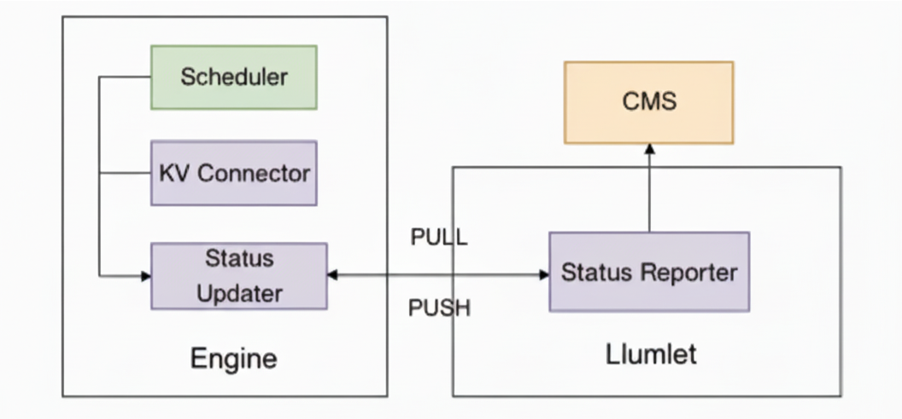

# Real-time Instance Status Tracking

## Architecture

Llumnix introduces a centralized Cluster Meta Store (CMS) dedicated to caching instance metadata and real-time status. Within this architecture, Llumlet is responsible for aggregating data from the inference engine and updating the CMS.

To collect the engine's real-time status, Llumnix requires access to internal states from components such as the Scheduler and KV Connector. Therefore, we have instrumented the engine with an internal Status Updater. This component supports both pushing status to Llumlet and allowing Llumlet to actively poll for updates. To ensure state freshness, the Status Updater's update cycle is tightly coupled with the engine's execution steps.

## Data Sources and Collection Architecture

### Engine intrusive changes

To capture real-time engine status, we implemented intrusive modifications to vLLM's `EngineCore.step()` method. The solution introduces four trigger points within the step execution flow to ensure comprehensive monitoring while avoiding blocking scenarios caused by conditional checks or long-running tasks:

1. Step-Begine Phase (`StepPhase.STEP_BEGIN`/`StepPhase.BYPASS_STEP_BEGIN`)
    
    * Captures pre-execution engine state immediately when step processing initiates.
        
2. Before-Return Phase (`StepPhase.BEFORE_RETURN`)
    
    * Records final state metrics when scheduler queue is empty.
        
3. After-Scheduling Phase (`StepPhase.AFTER_SCHEDULE`)
    
    * Monitors system state immediately following `scheduler.schedule()` completion
        
4. After-Update Phase (`StepPhase.AFTER_UPDATE`)
    
    * Tracks post-processing state after model output generation completes
        
    
    These trigger points are all invoked through `llumlet_proxy`.
    
### Engine Interaction Modes
    
The engine supports two status update modes (controlled by environment variable `LLUMNIX_UPDATE_INSTANCE_STATUS_MODE`), with push mode enabled by default:
    
* Push Mode: If enabled, during initialization, `llumlet_proxy` registers a stub to `llumlet`, and actively pushes updated status to `llumlet` immediately after status changes occur.
        
* Pull Mode: If enabled, `llumlet_proxy` still maintains status updates internally. Updated `llumlet`'s scheduled task calls `get_instance_status` and no active pushing occurs between polling intervals.
    
### Heartbeat and Metrics Reporting
    
`Llumlet` is responsible for reporting its schedulable status to the CMS, alongside real-time metrics. Although its primary update method is `PUSH` mode (when `LLUMNIX_UPDATE_INSTANCE_STATUS_MODE=PUSH`), it incorporates a crucial PULL-based health check as a fallback.
    
This mechanism activates when the engine is either idle (no requests) or appears unresponsive, having not pushed an `instance_status` within the timeout specified by `LLUMNIX_ENGINE_GET_STATUS_TIMEOUT`. In this scenario, `llumlet` proactively initiates a `get_instance_status` utility call to the engine.
    
If the engine responds promptly, it is confirmed to be idle but healthy, and thus remains schedulable. However, if this call times out, `llumlet` presumes the engine's main loop is frozen or it has entered an abnormal state. It then sets the schedulable status to `false`, signaling the scheduler to respond to the potential failure.
    
## Tracked status
    
Based on Llumsched's load balancing objectives (e.g., balancing batch size or token count), Llumlet needs to collect status such as the number of requests and number of cached tokens. More specifically, aligning with the request classification scheme of vLLM's scheduler, we can categorize these statuses into those associated with running requests and waiting requests.
    
* Running requests status: Metrics such as the number of running requests and token counts reflect the current engine load.
        
* Waiting requests status: These metrics typically indicate the status of Prefill-Decode (PD) disaggregation or request migration. For example, the number of requests waiting for prefill on a decode instance. Such status can provide insight into the engine's future workload, helping Llumsched avoid over-scheduling.
        
## How to Use

1. Standalone Metric Reporting: If you only need to use Llumnix for its metric reporting capabilities without integrating it with `LlumSched`, you can enable it by setting the environmental variable `VLLM_ENABLE_LLUMNIX=1` when inference service is started.
2. Full Cluster Deployment: For a full cluster deployment where Llumnix works in conjunction with the scheduler (`LlumSched`), use the `full-mode-scheduling` deployment. In this mode, `VLLM_ENABLE_LLUMNIX=1` is already set in the vLLM deployment YAML.