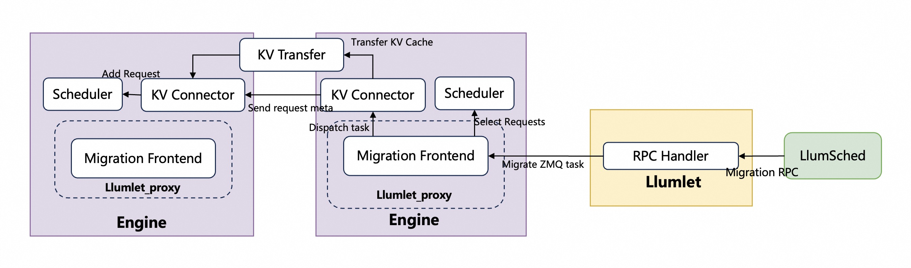
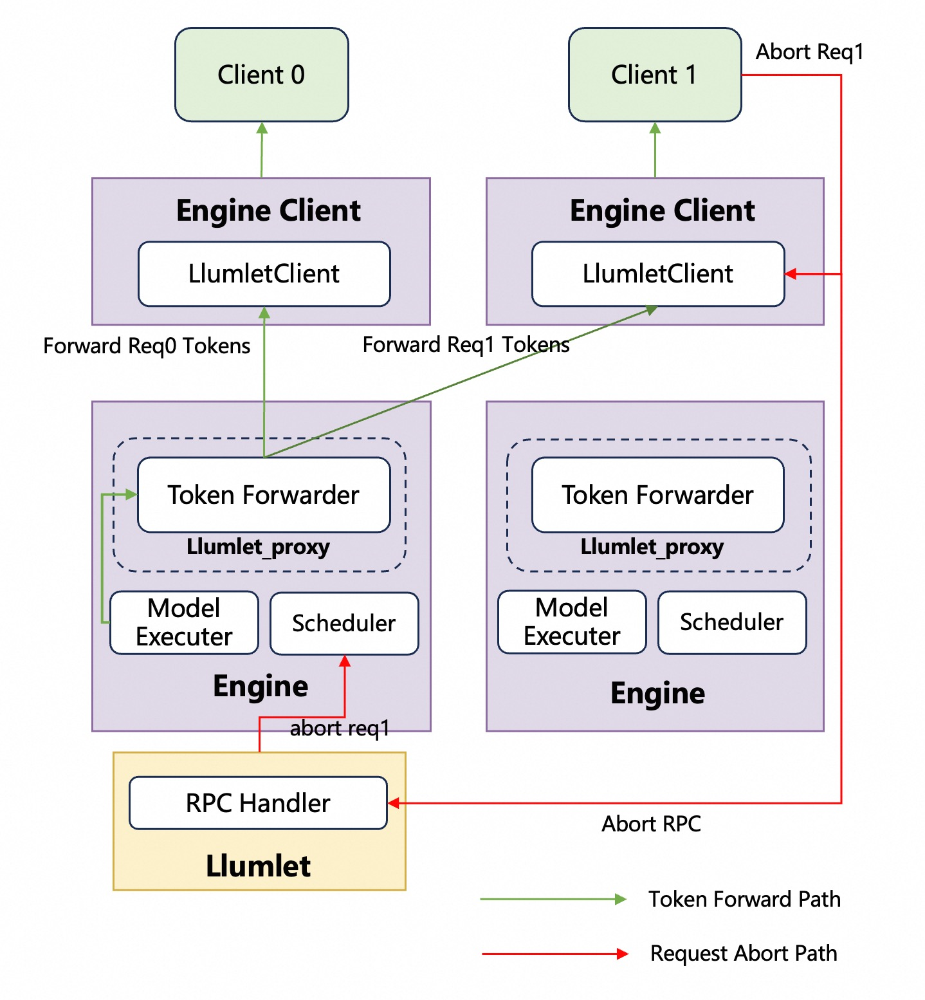

# Request Migration

## Workflow

## Request selection for migration

### Migration Type

Metrics classify requests by resource use, processing stage, and inherent migration cost.

*   `num_req` (Number of Requests): Total requests on a resource. Simple, but doesn't reflect individual request complexity or progress.
    
*   `num_tokens` (Number of Tokens): For LLMs, total tokens (input + generated). Indicates processing progress and KV cache size, influencing migration cost.
    
*   `block_ratio` (Block Ratio): For LLMs, KV cache memory block usage. Directly reflects memory footprint; lower ratios mean cheaper migration.
    

### priority

Request priority is beyond simple resource usage, directly linked to criticality and user experience. Migration policies dictate which requests are prioritized for migration, termination, or continuation, balancing various system and business objectives.

Common policies include:

*   `SR` (Shortest Running): Favored for migration due to lower cost and impact.
    
*   `LR` (Longest Running): Typically avoided for migration unless critical, due to higher cost and impact.
    
*   `FCR` (First Running): Selects the oldest active request.
    
*   `LCR` (Last Running): Targets the newest active request.
    
*   `FCW` (First Waiting): Prioritizes requests that have been queued longest, improving fairness or throughput for backlogged tasks.
    
*   `FCWSR` (First Waiting and Shortest Running): A hybrid policy designed to optimize for quick clearance of smaller tasks that have also waited the longest.
    

### pre-stop migration

Pre-stop migration in this context refers to a mechanism to proactively migrate in-flight requests from an unexpectedly stale or unhealthy instance to prevent request loss before it fully terminates, ensuring service continuity during failures.

This process is triggered when an instance's update interval exceeds a predefined threshold set by a rescheduler. Upon identifying such a 'stale' instance, the rescheduler initiates pre-stop migration by attempting to migrate all running/waiting requests from the stale instance to healthy, available instances. 

### Concurrency limitation

Concurrency limitation is a vital mechanism for controlling the overhead of migration and ensuring system stability. These limits are applied across several dimensions, often in combination:

*   `num_req` ： Limits the total number of individual requests that can be simultaneously in the process of migration.
    
*   `num_tokens` : Imposes a ceiling on the aggregate number of tokens involved in all currently migrating requests.
    
*   `kv_cache_usage` : Sets a maximum on the total memory footprint of the KV cache across all requests currently undergoing migration. This can be measured in blocks usage ratio.
    
## KV transfer
    
### Supported connectors & backends
    
The transfer of KV Cache state relies on an migration backend. The backends can utilize either the open-source Mooncake Transfer Engine or our proprietary, also open-source, solution, Blade-KVT.

* Mooncake Transfer Engine: A general-purpose, community-driven open-source backend. It provides a versatile and widely adopted standard for distributed KV cache transmission.
	* GitHub Repository: https://github.com/kvcache-ai/Mooncake

* Blade-KVT: Our natively developed transfer solution that we have also open-sourced to the community. While Mooncake focuses on broad generality, Blade-KVT is tailor-made and deeply optimized for our specific serving architecture. It provides seamless integration and out-of-the-box high performance for our customized scheduling systems. 
	* GitHub Repository: [https://github.com/AlibabaPAI/blade-kvt]
    
Similar to PD disaggregation, initiating a migration also depends on the KV connector（commonly activated by specifying the `--kv-transfer-config` parameter）. And to enable migration triggering, the existing connector interfaces must be extended. This extension involves adding new interfaces specifically for initiating migration tasks. Both Mooncake Connector and Hybrid Connector are currently supported. 
    
### KV connector implementation
    
#### KV connector extension
	
To enable migration, we will extend the KV connector's interfaces and add migration-triggering logic within the enginecore's main loop. The key logic is inserted at `kvconn_outputs = kvconn.step()`, which is responsible for processing incoming migration requests. We added RPC handlers to the KV connector to process migrate-in requests and pre-allocate KV blocks. After the KV cache is successfully transferred, the request will be added to the scheduler's waiting list. 

####  Bypass-migration

To reduce migration overhead and to support failover-triggered migration, we introduced a bypass path that operates independently of the enginecore's main loop, handling both triggering and execution asynchronously.

##  Token forwarding

{width="60%"}

### API Server Address-Aware 

To enable token forwarding back to the original requesting EngineClient, every request carries the    address of LlumnixClient. When a request is received by the API server, LlumnixClient stores a zmq address within the request's metadata, and this metadata is then propagated to the EngineCore. The address is maintained throughout the request's lifecycle and it is not altered, regardless of any migration happened.

### Abort Request Handling

In situations where requests are subject to migration, a challenge emerges: the original EngineClient might issue an abort command, or the request's output could trigger a stop string. To correctly handle this, the LlumnixClient is required to first send an Abort RPC to Llumlet, leveraging the Llumlet address provided within the EngineCoreOutput. Subsequently, Llumlet will forward this abort request to the EngineCore.