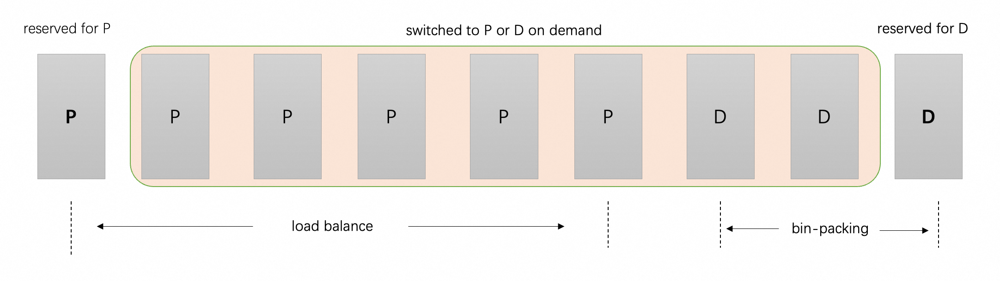
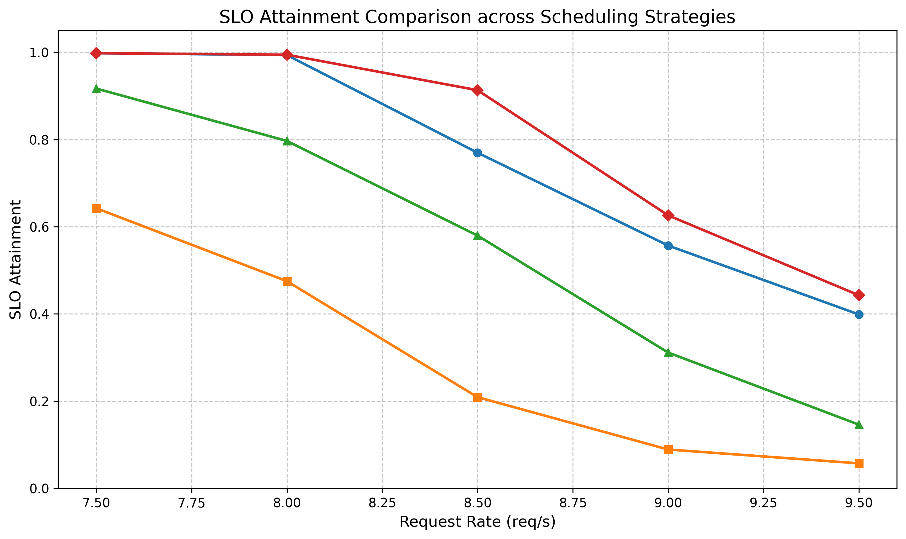
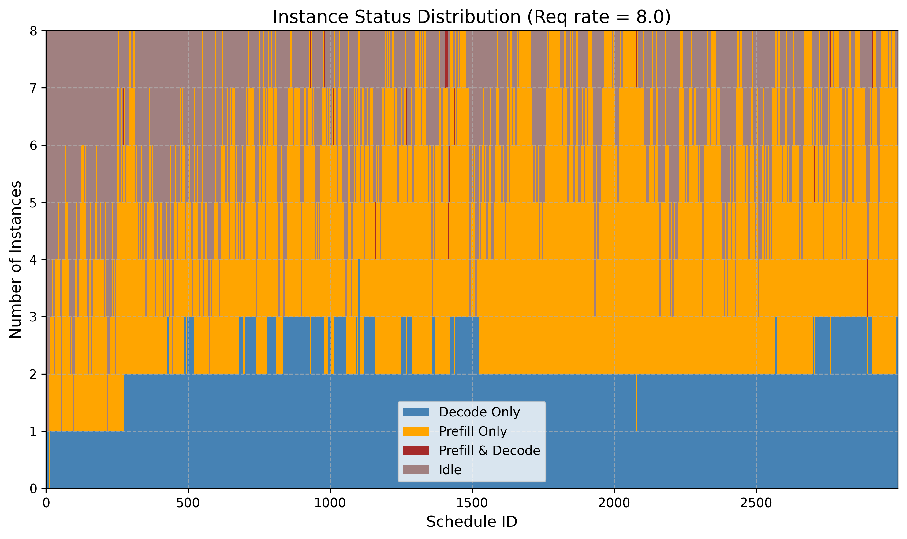

# Adaptive PD Scheduling

## Introduction

In PD (Prefill-Decode) disaggregated serving, instances are statically partitioned into prefill (P) and decode (D) roles. This static assignment is inherently vulnerable to instantaneous load fluctuations: when prefill traffic surges, P instances become bottlenecked while D instances sit idle, and vice versa. Adaptive PD scheduling dynamically adjusts the number of P and D instances at runtime based on real-time workload characteristics to maximize SLO attainment.

---

## Prerequisites

Adaptive PD scheduling imposes the following requirements on the underlying infrastructure. These conditions must be satisfied before enabling the feature:

- All instances must be capable of serving both prefill and decode requests.
- Prefill and decode operations can be distributed across any two instances, or co-located on a single instance.

---

## Overview

Under certain SLO constraints, static prefill-decode (PD) instance ratios exhibit an inherent limitation: when prefill instances are heavily loaded while decode instances remain underutilized, or vice versa, rebalancing the PD ratio involves instance-level scaling up and down — a heavyweight operation too cumbersome to keep pace with rapidly fluctuating traffic patterns. Adaptive PD addresses this by dynamically adjusting the effective number of prefill and decode instances at the scheduling layer — without any instance scaling or redeployment — leveraging only the pool of already-provisioned instances.

From the scheduler's perspective in Adaptive PD, one instance is always statically reserved for prefill and one for decode, ensuring functionality. All remaining instances are assigned roles dynamically at runtime to best accommodate the current workload. For decode, the governing principle is necessary and sufficient: **allocate just enough capacity to satisfy the TPOT SLO, but no more**. Since decode is a memory-bound operation, over-provisioning decode instances yields diminishing throughput gains while simultaneously shrinking the prefill instance pool — causing TTFT latency to grow roughly linearly as the number of available prefill instances decreases. Adaptive PD therefore employs a bin-packing strategy for decode scheduling: decode requests are consolidated onto the minimum number of instances required to satisfy the TPOT SLO, maximizing per-instance utilization and freeing as many instances as possible to serve as prefill workers. Prefill requests, in turn, are load-balanced across all instances not currently hosting active decode requests.

However, since decode is auto-regressive, token generation continuously increases KV cache occupancy, and bin-packing may easily lead to TPOT SLO violations as the sequence length grows. Meanwhile, consolidating decode requests onto fewer instances may also be warranted when multiple decode instances simultaneously exhibit low utilization. Llumnix tackles both cases through **live request rescheduling** — migrating requests across instances transparently, without disrupting ongoing inference.

---

## Reserve State Management

All instances are initially role-less. Upon engine launch, the scheduler randomly designates one instance as the reserved prefill and another as the reserved decode.

Reserved instances are given scheduling priority:

- Prefill scheduling: The reserved prefill is prioritized when two instances have equal predicted TTFT values.
- Decode scheduling: The reserved decode is preferentially selected to maximize utilization while remaining within the TPOT SLO.

Since reserved instances may crash or become unavailable, the scheduler attempts to re-elect reserve instances. Instances that only contain prefill or decode requests are considered as candidates first. If no such instance exists, the instances with the fewest prefill tokens and fewest active decode requests are selected as reserves.

---

## Scheduling Strategy

### Decode Instance Selection

The scheduler selects the instance with **the highest predicted TPOT that still satisfies the TPOT SLO** (bin-packing). If no such instance exists, the scheduler attempts to convert a prefill-only instance (excluding the reserved prefill) with the lowest predicted TTFT to serve as a decode instance. If no instance can satisfy the TPOT SLO under any assignment, the scheduler falls back to load balancing across all decode instances.

### Prefill Instance Selection

The scheduler selects the instance with the lowest predicted TTFT among instances with no active decode workload. Because one instance is always reserved for prefill, there is always at least one eligible candidate.

### Integration with SLO Scheduling Policy

Adaptive PD integrates with the SLO scheduling policy, but differs from the standard SLO policy in one key way: **rather than rejecting requests that cannot meet SLO targets, it always returns an instance**. Specifically, Adaptive PD dynamically reassigns instance roles to satisfy SLOs whenever possible, and degrades gracefully when they cannot be met. When SLO attainment deviates from the expected value for an extended period, external infrastructure is responsible for scaling out or in accordingly. In a future release, a configurable argument will be added to allow users to choose whether to reject requests that fail to meet SLO targets.

---

## Rescheduling Strategy

As decode scheduling uses bin-packing, two scenarios need to be handled:
- Overload: As active decode tokens accumulate, predicted TPOT may rise and breach the TPOT SLO.
- Underload: As decode requests complete, some instances may become underutilized and eligible for consolidation.

For adaptive PD related rescheduling, only decode requests will be migrated and at most one migration pair for each rescheduling policy is generated during each rescheduling cycle. To address the problem described above, two rescheduling policies are designed: `binpacking_mitigation` and `binpacking_consolidation`.

`binpacking_mitigation` migrates requests from overloaded instances to underutilized ones based on predicted TPOT, aiming to restore TPOT compliance through bin-packing consolidation. It pairs the most overloaded source instance with the most loaded destination instance whose predicted TPOT is below the TPOT SLO. This strategy prioritizes relieving the highest-pressure instance while efficiently utilizing spare capacity on destination instances.

`binpacking_consolidation` migrates requests from underutilized instances to more heavily loaded ones, improving resource utilization by packing workloads more densely. It pairs the least loaded source instance with the most loaded destination instance. This strategy empties the lightest instances, progressively freeing them for reassignment to prefill. In additon, the reserved decode instance would not be chosen as a migration source.

---

## Configuration

| Flag | Setting | Description |
|------|---------|-------------|
| `--enable-full-mode-scheduling` | `true` | Requires full-mode scheduling. |
| `--scheduling-policy` | `slo` | Must be set to `slo` for adaptive PD. |
| `--enable-adaptive-pd` | `true` | Enable adaptive PD scheduling. |
| `--tpot-slo` | `50` | TPOT SLO target (ms). |
| `--tpot-slo-dispatch-threshold` | `0.85` | Fraction of TPOT SLO used as the dispatch filter threshold. |
| `--colocated-reschedule-mode` | `true` | Enable colocated reschedule mode. (standalone rescheduling is also supported). |
| `--reschedule-interval-ms` | `100` | Reschedule interval. |
| `--reschedule-policies` | `binpacking_mitigation,binpacking_consolidation` | Reschedule policies. |
| `--tpot-migrate-out-ceil-threshold` | `0.95` | Fraction of TPOT SLO above which overload rescheduling triggers. |
| `--tpot-migrate-out-floor-threshold` | `0.60` | Fraction of TPOT SLO below which underload rescheduling triggers. |
| `--enable-instance-status-local-account` (Optional) | `true` | Enable instance status local account. |

---

## Performance

Setup: Qwen3-32B, TP=1 (H20), evaluated on [the Azure LLM Inference Trace (Conversational) dataset](https://github.com/Azure/AzurePublicDataset/blob/master/data/AzureLLMInferenceTrace_conv.csv), deployed on 8 vLLM instances.

SLO targets: TPOT ≤ 50 ms, TTFT ≤ 6000 ms.

Adaptive PD is compared against a load balancing scheduling policy based on the number of prefill and decode tokens. Specifically, the comparison targets two static deployment configurations: 3D/5P and 2D/6P. With a static assignment of 3D / 5P, the decode side is adequately handled, but the prefill instances are severely overloaded. Changing to 2D / 6P alleviates prefill pressure, but causes a significant drop in TPOT SLO attainment.

Adaptive PD overcomes this rigidity by continuously adjusting the effective number of P and D instances in response to real-time workload dynamics, as illustrated in the instance status distribution figure above. This enables a substantially high degree of SLO attainment across both TTFT and TPOT dimensions simultaneously — a level of balance that no static P/D assignment can consistently achieve.

## Future Work

Threshold auto-tuning: The parameters tpot-slo-dispatch-threshold, tpot-migrate-out-ceil-threshold, and tpot-migrate-out-floor-threshold currently require manual tuning. Investigating automated or adaptive methods to set these thresholds based on workload characteristics is a promising direction.

Multi-modal inference support: Exploring how Adaptive PD can be extended to support multi-modal inference scenarios in the context of EPD (Encode-Prefill-Decode) disaggregation, is an important next step.
